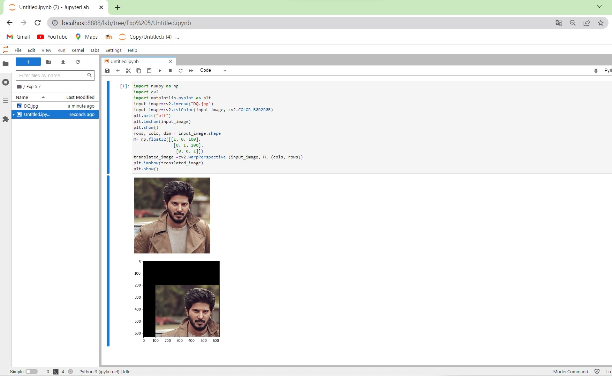
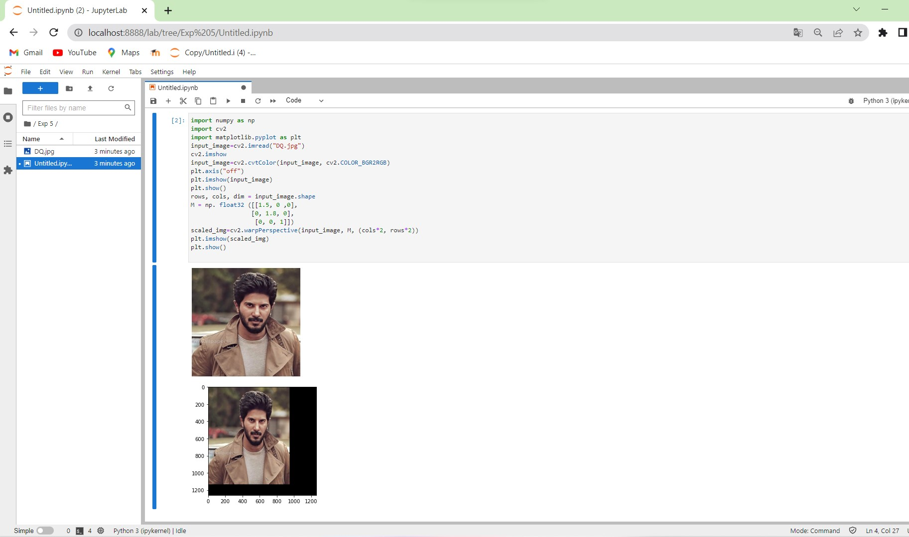
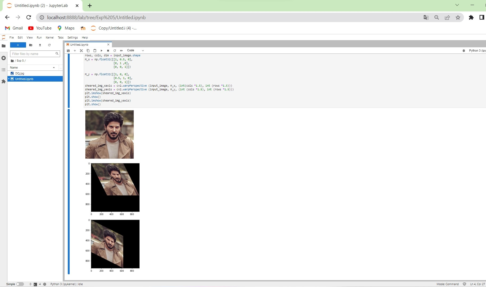
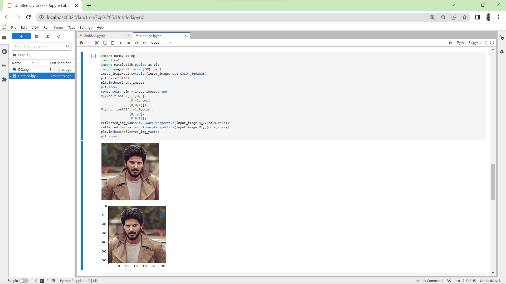
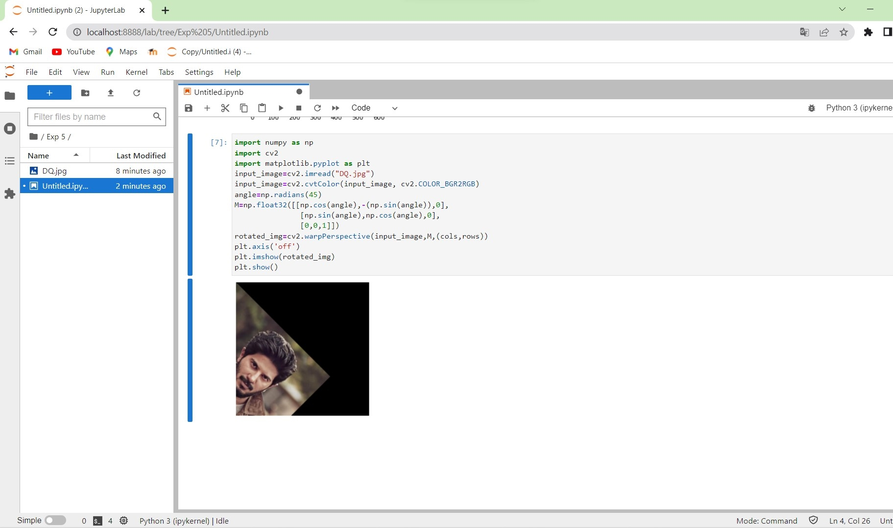
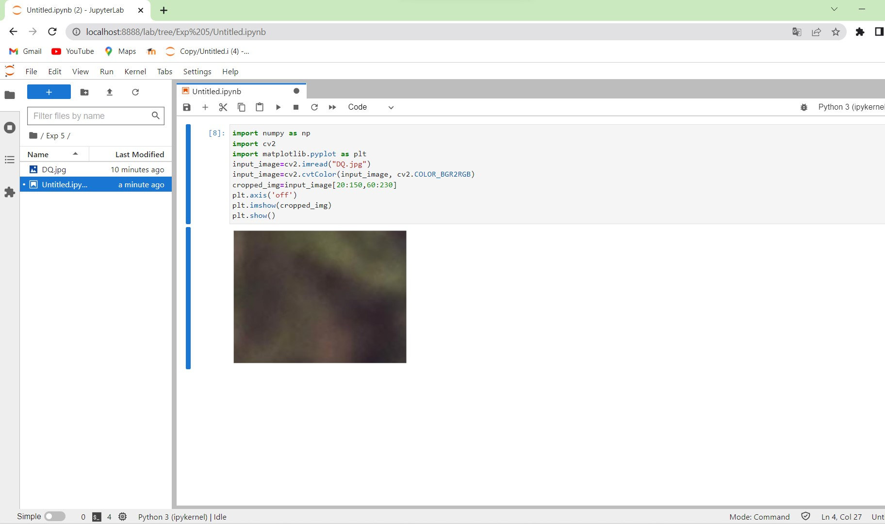

# Image-Transformation
## Aim
To perform image transformation such as Translation, Scaling, Shearing, Reflection, Rotation and Cropping using OpenCV and Python.

## Software Required:
Anaconda - Python 3.7

## Algorithm:

### Step 1:
Import the necessary libraries and read the original image and save it as a image variable.
<br>

### Step 2:
Translate the image using the respective coding.
<br>

### Step 3:
Scale the image using the respective coding.
<br>

### Step 4:
Shear the image using the respective coding.
<br>

### Step 5:
Reflection of image can be achieved through the respective coding.
<br>

### Step 6:
Rotate the image using the respective coding.
<br>

### Step 7:
Crop the image using the respective coding.
<br>

### Step 8:
Display all the Transformed images.
<br>

## Program:

```python
Developed By: SWATHIKA G
Register Number:212221230113

i)Image Translation:

import numpy as np
import cv2
import matplotlib.pyplot as plt
input_image=cv2.imread("DQ.jpg") 
input_image=cv2.cvtColor(input_image, cv2.COLOR_BGR2RGB) 
plt.axis("off") 
plt.imshow(input_image)
plt.show()
rows, cols, dim = input_image.shape
M= np.float32([[1, 0, 100],
                [0, 1, 200],
                 [0, 0, 1]])
translated_image =cv2.warpPerspective (input_image, M, (cols, rows))
plt.imshow(translated_image)
plt.show()

ii) Image Scaling:

import numpy as np
import cv2
import matplotlib.pyplot as plt
input_image=cv2.imread("DQ.jpg") 
cv2.imshow
input_image=cv2.cvtColor(input_image, cv2.COLOR_BGR2RGB) 
plt.axis("off") 
plt.imshow(input_image)
plt.show()
rows, cols, dim = input_image.shape
M = np. float32 ([[1.5, 0 ,0],
                 [0, 1.8, 0],
                  [0, 0, 1]])
scaled_img=cv2.warpPerspective(input_image, M, (cols*2, rows*2))
plt.imshow(scaled_img)
plt.show()

iii)Image shearing:

import numpy as np
import cv2
import matplotlib.pyplot as plt
input_image=cv2.imread("DQ.jpg") 
cv2.imshow
input_image=cv2.cvtColor(input_image, cv2.COLOR_BGR2RGB) 
plt.axis("off") 
plt.imshow(input_image)
plt.show()
rows, cols, dim = input_image.shape
M_x = np.float32([[1, 0.5, 0],
                  [0, 1 ,0],
                  [0, 0, 1]])

M_y = np.float32([[1, 0, 0],
                  [0.5, 1, 0],
                  [0, 0, 1]])
sheared_img_xaxis = cv2.warpPerspective (input_image, M_x, (int(cols *1.5), int (rows *1.5))) 
sheared_img_yaxis = cv2.warpPerspective (input_image, M_y, (int (cols *1.5), int (rows *1.5)))
plt.imshow(sheared_img_xaxis)
plt.show()
plt.imshow(sheared_img_yaxis)
plt.show()

iv)Image Reflection:

import numpy as np
import cv2
import matplotlib.pyplot as plt
input_image=cv2.imread("DQ.jpg") 
input_image=cv2.cvtColor(input_image, cv2.COLOR_BGR2RGB) 
plt.axis("off") 
plt.imshow(input_image)
plt.show()
rows, cols, dim = input_image.shape
M_x=np.float32([[1,0,0],
               [0,-1,rows],
               [0,0,1]])
M_y=np.float32([[-1,0,cols],
               [0,1,0],
               [0,0,1]])
reflected_img_xaxis=cv2.warpPerspective(input_image,M_x,(cols,rows))
reflected_img_yaxis=cv2.warpPerspective(input_image,M_y,(cols,rows))
plt.imshow(reflected_img_yaxis)
plt.show()

v)Image Rotation:

import numpy as np
import cv2
import matplotlib.pyplot as plt
input_image=cv2.imread("DQ.jpg") 
input_image=cv2.cvtColor(input_image, cv2.COLOR_BGR2RGB)
angle=np.radians(45)
M=np.float32([[np.cos(angle),-(np.sin(angle)),0],
               [np.sin(angle),np.cos(angle),0],
               [0,0,1]])
rotated_img=cv2.warpPerspective(input_image,M,(cols,rows))
plt.axis('off')
plt.imshow(rotated_img)
plt.show()

vi)Image Cropping:

import numpy as np
import cv2
import matplotlib.pyplot as plt
input_image=cv2.imread("DQ.jpg") 
input_image=cv2.cvtColor(input_image, cv2.COLOR_BGR2RGB)
cropped_img=input_image[20:150,60:230]
plt.axis('off')
plt.imshow(cropped_img)
plt.show()
```
## Output:
### i)Image Translation

<br>

### ii) Image Scaling

<br>

### iii)Image shearing

<br>

### iv)Image Reflection

<br>

### v)Image Rotation

<br>

### vi)Image Cropping


## Result: 
Thus the different image transformations such as Translation, Scaling, Shearing, Reflection, Rotation and Cropping are done using OpenCV and python programming.
